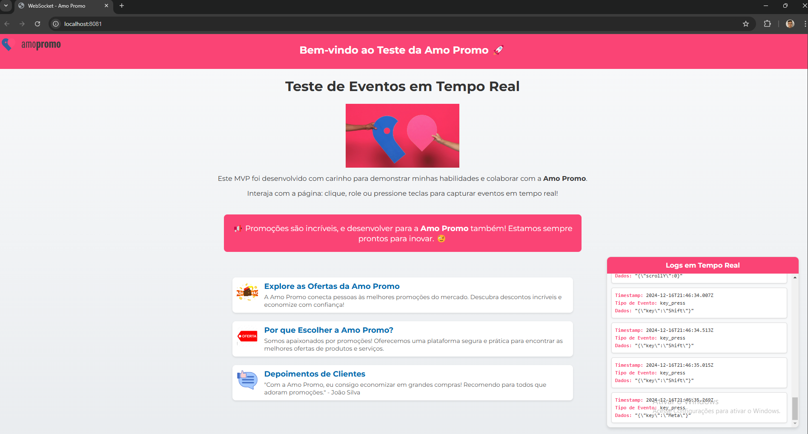
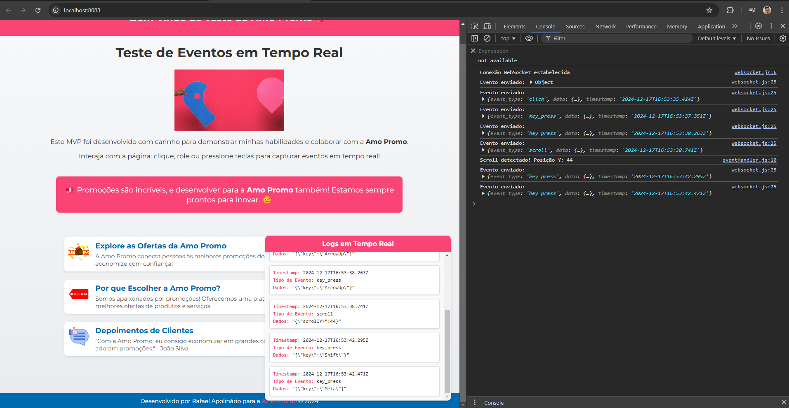

# WebSocketGo

> Sistema de coleta e armazenamento de dados utilizando WebSocket, com backend em Go e frontend em JavaScript.

---

## 🚀 Sobre o Projeto

Este projeto implementa um sistema completo para **coleta de eventos** em páginas web utilizando **WebSocket**. Os dados coletados são armazenados em um banco de dados PostgreSQL e podem ser utilizados para análise de interação do usuário em tempo real.

---

## 🎯 Objetivo

- Criar um **backend** em Go para gerenciar conexões WebSocket, registrar eventos em um banco de dados PostgreSQL e exibir logs.
- Desenvolver um **frontend** em JavaScript que coleta e envia eventos de interação para o servidor.

---

## 📷 Imagens do Projeto

### Interface Principal


### Logs no Console


---

## 🛠️ Pré-requisitos

Antes de começar, instale as seguintes ferramentas:

- [Go](https://golang.org/doc/install)
- [Node.js](https://nodejs.org)
- [PostgreSQL](https://www.postgresql.org/download)

---

## ⚙️ Configuração do Projeto

### 1. Instalação

Clone este repositório:

```bash
git clone https://github.com/RafaelApolinario/WebSocketGo.git
cd WebSocketGo
```

2. Execute o script de configuração para instalar as dependências do backend e do frontend:

   **PowerShell**:

   ```
   cd scripts
   .\setup.ps1
   ```

   **Linux/Mac**:

   ```
   cd scripts
   .\setup.ps1
   ```

## ⚙️ Configure o banco de dados PostgreSQL:

3. Crie uma tabela events com a estrutura:
sql

``      CREATE TABLE events (
         id SERIAL PRIMARY KEY,
         event_type VARCHAR(255),
         data JSONB,
         timestamp TIMESTAMP DEFAULT CURRENT_TIMESTAMP
      );``

Atualize o arquivo .env no backend com as credenciais do banco.

   ### ▶️ Como Executar:

   **PowerShell**:

   ```
   cd scripts
   .\start.ps1
   ```

   **Linux/Mac**:
   
   ```
   cd scripts
   chmod +x setup.sh start.sh
   ./start.sh
   ```
 ### 🧰 Tecnologias Utilizadas
Backend: Go, WebSocket, PostgreSQL
Frontend: HTML, CSS, JavaScript
Scripts: PowerShell, Bash

### 🔄 Funcionamento
O frontend coleta eventos de interação do usuário (como cliques, formulários preenchidos).
Os eventos são enviados ao backend via WebSocket.
O backend armazena os eventos no PostgreSQL e os retransmite para todos os clientes conectados.
O frontend exibe logs e atualizações em tempo real no console.